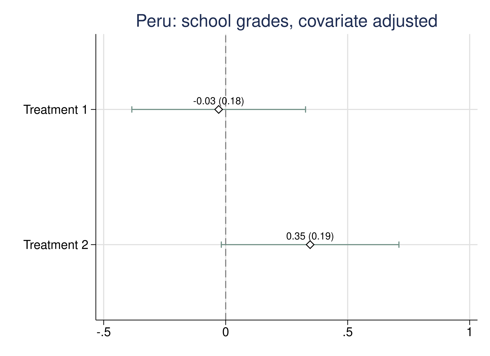
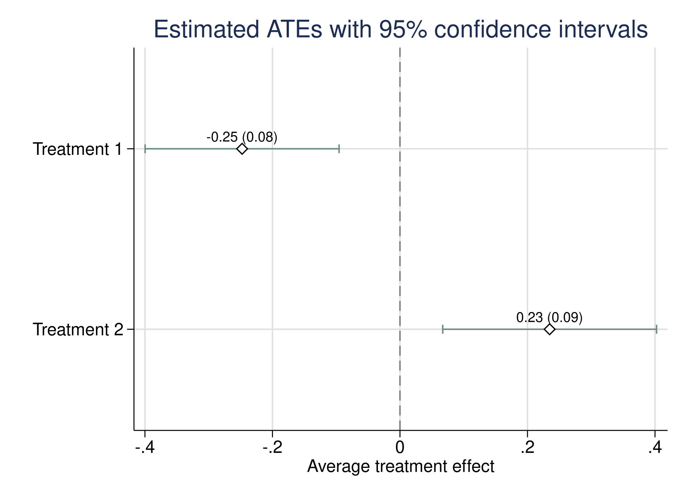

# sreg: Stratified Randomized Experiments (Stata® Edition)<br><a href="https://github.com/jutrifonov/sreg-stata"></a>


[](LICENSE)

The `sreg` package for **Stata** estimates average treatment effects (ATEs) in stratified randomized experiments. It supports matched pairs, $k$-tuple designs, large strata of potentially unequal sizes, and designs that combine small and large strata. Estimation accommodates multiple treatments, individual- and cluster-level treatment assignment, and optimal linear covariate adjustment using baseline characteristics.

The package is implemented entirely in Stata and Mata.

**Dependencies:** No additional packages required.

**Stata version required:** 14.2 or newer.

<br clear="right" />

## Authors

- Juri Trifonov jutrifonov@u.northwestern.edu

- Yuehao Bai yuehao.bai@usc.edu

- Azeem Shaikh amshaikh@uchicago.edu

- Max Tabord-Meehan m.tabordmeehan@utoronto.ca

## Supplementary files

- Command documentation: `help sreg`, `help sregplot`, and `help sreg_rgen` after installation.

## Installation

Download this repository using **Code → Download ZIP**, then unzip it. In Stata, install from the extracted folder, replacing the path below with its location:

```stata
net install sreg, from("/path/to/sreg-stata") replace
help sreg
```

Access to the repository is currently required to download it. Once installed, the package runs entirely within Stata.

## Try the package

The [hands-on do-file](examples/try_sreg.do) installs the package, downloads its example data, and runs individual and clustered examples with large, small, and mixed strata. It also demonstrates the Peru empirical application using the included **AEJapp data (215 observations, 62 variables)**.

From the downloaded repository folder in Stata:

```stata
do examples/try_sreg.do
```

The walkthrough saves tables, estimates, plots, and a log in `examples/output/`. Save any work in memory before running it. For the dataset's source and empirical specification, see `help sreg_aejapp` after installation.

## Command: `sreg`

Estimates treatment effects relative to the control group and reports design-based standard errors and confidence intervals.

### Syntax

```stata
sreg outcome [covariates] [if] [in], treatment(varname) ///
    [strata(varname) cluster(varname) clustersize(varname) ///
     smallstrata k(#) nohc1 level(#)]
```

### Arguments and options

- **`outcome`** — the variable containing observed outcomes.
- **`covariates`** — optional baseline covariates for linear adjustment. Omit them for unadjusted estimation.
- **`treatment(varname)`** — treatment assignment, with `0` denoting control and `1, 2, …` the active treatments.
- **`strata(varname)`** — stratum indicators. Omit for an experiment without stratification.
- **`cluster(varname)`** — cluster identifiers when treatment is assigned at the cluster level. Omit for individual assignment.
- **`clustersize(varname)`** — represented cluster sizes. If omitted, sizes are inferred from the observations used in each cluster.
- **`smallstrata`** — selects estimation for small strata or a mixture of small and large strata.
- **`k(#)`** — the number of assignment units per small stratum. Optional for uniform small strata; specify it for mixed designs with 4-tuples or larger.
- **`nohc1`** — turns off the HC1 finite-sample correction, which is enabled by default.
- **`level(#)`** — confidence level; the default is `95`.

For cluster-randomized experiments, individual-level covariates are averaged within clusters before adjustment. Treatment, stratum, and represented size must be constant within each cluster.

### Example: large strata

Generate a two-treatment experiment and estimate both effects with covariate adjustment:

```stata
set rng mt64
set seed 2026
sreg_rgen, n(1000) individual strata(4) tau(-.3 .2) clear
sreg Y x_1 x_2, treatment(D) strata(S)
```

### Summary

`sreg` displays the estimated effects, standard errors, normal z statistics, p-values, and asymptotic confidence intervals:

```text
Saturated Model Estimation Results under CAR with linear adjustments
Observations:      1,000
Number of treatments: 2
Number of strata: 4
Setup: large strata
Standard errors: adjusted (HC1)
Treatment assignment: individual level
Covariates used in linear adjustments:  x_1 x_2
------------------------------------------------------------------------------
             |            Design-based
           Y |      Coef.   Std. Err.      z    P>|z|     [95% Conf. Interval]
-------------+----------------------------------------------------------------
        tau1 |  -.2476206   .0775952    -3.19   0.001    -.3997044   -.0955369
        tau2 |   .2347557   .0855676     2.74   0.006     .0670464     .402465
------------------------------------------------------------------------------
```

### Stored results

Treatment effects are named `tau1`, `tau2`, and so on. Estimates are stored in `e(b)` and their covariance matrix in `e(V)`. Use standard Stata commands to inspect results or estimate contrasts:

```stata
matrix list e(b)
matrix list e(V)
lincom tau2 - tau1
```

Run `sreg` without arguments to display the estimation table again. See `help sreg` for the complete list of stored results.

## Empirical illustration

The package includes the AEJapp dataset from Chong et al. (2016), who studied
iron deficiency and educational attainment among school-age children in Peru.
The dataset contains 215 observations and 62 variables.

The example below uses:

| Variable | Description |
|---|---|
| `gradesq34` | Sum of average grades in the final two quarters |
| `treatment` | Original treatment status; code 3 is the control group |
| `class_level` | School-year stratum |
| `pills_taken` | Number of pills taken by the student |
| `age_months` | Student age in months |

### Load the data

After downloading the repository, replace `/path/to/sreg-stata` with the
complete location of the package on your computer. `net get` copies the
example dataset into Stata's current working folder, and `use` loads it into
memory:

```stata
net get sreg, from("/path/to/sreg-stata") replace
use "sreg_aejapp.dta", clear
```

Stata 14.2 requires the complete folder path here; `from(".")` is not
accepted. You can see the current working folder with `pwd`. Alternatively,
load the file directly:

```stata
use "/path/to/sreg-stata/data/sreg_aejapp.dta", clear
```

You can inspect the complete dataset with `describe`. To look only at the
variables used in this illustration:

```stata
describe gradesq34 treatment class_level pills_taken age_months
list gradesq34 treatment class_level pills_taken age_months in 1/10
```

The first ten observations look like this:

```text
     +-------------------------------------------------------+
     | gradesq34   treatment   class_level   pills_taken   age_months |
     |-------------------------------------------------------|
  1. |      11.2           1             1             0      156.846 |
  2. |      12.4           3             3            16     186.4148 |
  3. |      11.9           3             5             5     209.0513 |
  4. |      13.1           3             1            21     146.2012 |
  5. |      13.4           2             2             9     168.7721 |
  6. |      10.7           3             1             5      146.037 |
  7. |      12.8           3             1            27     153.5277 |
  8. |      10.9           2             1             1     146.0041 |
  9. |      13.2           2             1            59     151.6222 |
 10. |      11.2           1             3            41     174.2916 |
     +-------------------------------------------------------+
```

### Prepare the treatment variable

`sreg` expects the control group to be coded `0`. In the original data the
control group is coded `3`, so create a new treatment variable named `D` while
leaving the original variable unchanged:

```stata
generate byte D = cond(treatment == 3, 0, treatment)
tabulate D class_level
```

```text
           |                     Year in School
         D |         1          2          3          4          5 |     Total
-----------+-------------------------------------------------------+----------
         0 |        15         19         16         12         10 |        72
         1 |        16         19         15         10         10 |        70
         2 |        17         20         15         11         10 |        73
-----------+-------------------------------------------------------+----------
     Total |        48         58         46         33         30 |       215
```

### Estimate treatment effects without covariates

Pass the outcome before the comma and identify the treatment and strata
variables in the options:

```stata
sreg gradesq34, treatment(D) strata(class_level)
estimates store unadjusted
```

```text
Saturated Model Estimation Results under CAR
Observations:        215
Number of treatments: 2
Number of strata: 5
Setup: large strata
Standard errors: adjusted (HC1)
Treatment assignment: individual level
Covariates used in linear adjustments:
------------------------------------------------------------------------------
             |            Design-based
   gradesq34 |      Coef.   Std. Err.      z    P>|z|     [95% Conf. Interval]
-------------+----------------------------------------------------------------
        tau1 |  -.0511297   .2064541    -0.25   0.804    -.4557724     .353513
        tau2 |   .4090337   .2065146     1.98   0.048     .0042726    .8137948
------------------------------------------------------------------------------
```

`tau1` is treatment 1 relative to control, and `tau2` is treatment 2 relative
to control.

### Add covariate adjustment

Covariates are written after the outcome and before the comma:

```stata
sreg gradesq34 pills_taken age_months, treatment(D) strata(class_level)
estimates store adjusted
```

```text
Saturated Model Estimation Results under CAR with linear adjustments
Observations:        215
Number of treatments: 2
Number of strata: 5
Setup: large strata
Standard errors: adjusted (HC1)
Treatment assignment: individual level
Covariates used in linear adjustments:  pills_taken age_months
------------------------------------------------------------------------------
             |            Design-based
   gradesq34 |      Coef.   Std. Err.      z    P>|z|     [95% Conf. Interval]
-------------+----------------------------------------------------------------
        tau1 |  -.0286159   .1816173    -0.16   0.875    -.3845793    .3273475
        tau2 |   .3460869   .1857249     1.86   0.062    -.0179273    .7101011
------------------------------------------------------------------------------
```

### Extract and compare results

Stata keeps the latest estimates in `e(b)` and the corresponding covariance
matrix in `e(V)`. The `_b[]` and `_se[]` notation extracts one named result:

```stata
display _b[tau1]
display _se[tau1]
display _b[tau2]
matrix list e(b)
matrix list e(V)
ereturn list
```

For example, `matrix list e(b)` after the adjusted model gives:

```text
e(b)[1,2]
          tau1        tau2
y1  -.02861589   .34608688
```

Compare the specifications side by side:

```stata
estimates table unadjusted adjusted, b(%9.5f) se(%9.5f) stats(N)
```

```text
--------------------------------------
    Variable | unadjusted    adjusted
-------------+------------------------
        tau1 |   -0.05113    -0.02862
             |    0.20645     0.18162
        tau2 |    0.40903     0.34609
             |    0.20651     0.18572
-------------+------------------------
           N |        215         215
--------------------------------------
                          legend: b/se
```

Finally, restore the adjusted model and plot its treatment effects:

```stata
estimates restore adjusted
sregplot, treatmentlabels("Treatment 1" "Treatment 2") ///
    title("Peru: school grades, covariate adjusted") bgcolor(white)
```



The complete sequence is also included in
[`examples/try_sreg.do`](examples/try_sreg.do). After installation, run
`help sreg_aejapp` for the dataset source and citation.

### Example: small strata

Generate matched triplets with one control and two active treatments per stratum:

```stata
set seed 2026
sreg_rgen, n(300) individual tau(1.2 .8) ///
    smallstrata k(3) treatsizes(1 1 1) clear

sreg Y x_1 x_2, treatment(D) strata(S) smallstrata
```

Because all strata have the same size, `sreg` identifies the triplets directly. Adding `k(3)` to the estimation command is an optional validation check.

### Example: mixed small and large strata

Here, 80 observations form 20 small strata of size four, and the remaining 40 observations are assigned to four large-stratum bins:

```stata
set seed 2026
sreg_rgen, n(120) individual tau(.5) ///
    mixedstrata nsmall(80) k(4) treatsizes(2 2) strata(4) clear

sreg Y, treatment(D) strata(S) smallstrata k(4)
```

Use `smallstrata` for estimation of the mixed design and specify `k(4)` to identify its small component. At least 25% of the strata must have the selected small-stratum size. Without `k()`, automatic detection covers conventional pairs and triplets.

### Example: cluster-level treatment assignment

Generate 300 clusters and estimate the effects with covariate adjustment:

```stata
set seed 2026
sreg_rgen, n(300) strata(4) tau(.5 .8) clear

sreg Y x_1 x_2, treatment(D) strata(S) ///
    cluster(G_id) clustersize(Ng)
```

For clustered small or mixed designs, also supply `smallstrata` and, where appropriate, `k()` to the estimation command.

## Command: `sregplot`

Plots estimated treatment effects and their confidence intervals after `sreg`.

### Syntax

```stata
sregplot [, treatmentlabels("label 1" "label 2" ...) ///
    level(#) title(string) xtitle(string)]
```

### Example

```stata
set rng mt64
set seed 2026
sreg_rgen, n(1000) individual strata(4) tau(-.3 .2) clear
sreg Y x_1 x_2, treatment(D) strata(S)

sregplot, treatmentlabels("Treatment 1" "Treatment 2") ///
    title("Estimated ATEs with 95% confidence intervals") ///
    xtitle("Average treatment effect") bgcolor(white)
```



Use `help sregplot` for color, marker, label, and graph-saving options.

## Command: `sreg_rgen`

Generates outcomes, treatment assignments, strata, covariates, and, for cluster designs, cluster identifiers and sizes.

### Syntax

```stata
sreg_rgen, n(#) [individual strata(#) nmax(#) tau(numlist) ///
    gamma(numlist) nocovariates smallstrata mixedstrata ///
    k(#) treatsizes(numlist) nsmall(#) clear]
```

### Main options

- **`n(#)`** — number of clusters by default, or number of individuals with `individual`.
- **`individual`** — generates individual-level treatment assignment.
- **`strata(#)`** — number of large-stratum bins; default `10`.
- **`nmax(#)`** — maximum cluster size; default `50`, in multiples of `10`.
- **`tau(numlist)`** — true effects for the active treatments; default `0` for one treatment.
- **`gamma(numlist)`** — three outcome-model coefficients; default `.4 .2 1`.
- **`smallstrata`** / **`mixedstrata`** — generates small strata or a mixture of small and large strata.
- **`k(#)`** — number of assignment units per small stratum.
- **`treatsizes(numlist)`** — assignment counts within each small stratum, control first; counts must sum to `k()`.
- **`nsmall(#)`** — assignment units in the small component of a mixed design.
- **`nocovariates`** — omits the generated covariates.
- **`clear`** — allows replacement of the data currently in memory.

### Generated variables

| Variable | Description |
|---|---|
| `Y` | Observed outcome |
| `S` | Stratum identifier |
| `D` | Treatment assignment; control is `0` |
| `x_1`, `x_2` | Baseline covariates, unless omitted |
| `G_id` | Cluster identifier, for cluster designs |
| `Ng` | Cluster size, for cluster designs |

### Example: matched pairs

```stata
set seed 2026
sreg_rgen, n(100) individual tau(1.2) ///
    smallstrata k(2) treatsizes(1 1) clear

sreg Y x_1 x_2, treatment(D) strata(S) smallstrata
```

For custom treatment allocations and stratum-specific effects, see `help sreg_rgen`.

## References

Bugni, F. A., Canay, I. A., and Shaikh, A. M. (2018). Inference Under Covariate-Adaptive Randomization. *Journal of the American Statistical Association*, 113(524), 1784–1796, doi:10.1080/01621459.2017.1375934.

Bugni, F., Canay, I., Shaikh, A., and Tabord-Meehan, M. (2024+). Inference for Cluster Randomized Experiments with Non-ignorable Cluster Sizes. *Forthcoming in the Journal of Political Economy: Microeconomics*, doi:10.48550/arXiv.2204.08356.

Jiang, L., Linton, O. B., Tang, H., and Zhang, Y. (2023+). Improving Estimation Efficiency via Regression-Adjustment in Covariate-Adaptive Randomizations with Imperfect Compliance. *Forthcoming in Review of Economics and Statistics*, doi:10.48550/arXiv.2204.08356.

Bai, Y., Jiang, L., Romano, J. P., Shaikh, A. M., and Zhang, Y. (2024). Covariate adjustment in experiments with matched pairs. *Journal of Econometrics*, 241(1), doi:10.1016/j.jeconom.2024.105740.

Bai, Y. (2022). Optimality of Matched-Pair Designs in Randomized Controlled Trials. *American Economic Review*, 112(12), doi:10.1257/aer.20201856.

Bai, Y., Romano, J. P., and Shaikh, A. M. (2022). Inference in Experiments With Matched Pairs. *Journal of the American Statistical Association*, 117(540), doi:10.1080/01621459.2021.1883437.

Liu, J. (2024). Inference for Two-stage Experiments under Covariate-Adaptive Randomization. doi:10.48550/arXiv.2301.09016.

Cytrynbaum, M. (2024). Covariate Adjustment in Stratified Experiments. *Quantitative Economics*, 15(4), 971–998, doi:10.3982/QE2475

## License

MIT. See [LICENSE](LICENSE).
